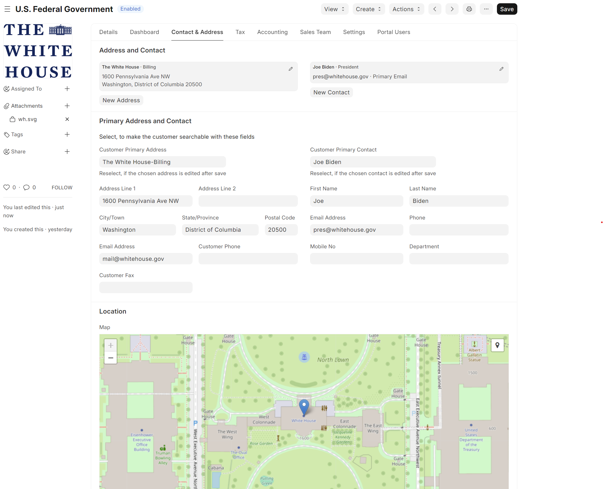

## Customer Information System Enhancements for ERPNext

This app adds various enhancements to the customer, contact, and address management for ERPNext. The target audience is small business, where a single contact and address per customer is common. Frappe geolocation is used to provide map views of the customer addresses.

## What does it do?

- Adds geolocation and address validation to the Address Doctype (utilizes the free OpenStreetMap Nominatim service)
- Sets the default address and contact automatically on the Customer Doctype
- Enables default address and contact editing on the Customer Doctype
- Provides a map view with basic customer information for the Customer Doctype

## What does it look like?

Here's a screenshot of the Customer Doctype with the new primary address and contact editing functionality:



Here's a screenshot of the Customer Doctype with the new map view functionality:


## How to install?

Install the app using the following commands

```bash
bench get-app https://github.com/Avunu/erpnext_cis_plus
bench --site [site-name] install-app erpnext_cis_plus
```

## Show me the code!

Sure!
- The custom fields and properties Doctype overrides are located in [erpnext_cis_plus/erpnext_cis_plus/custom/](erpnext_cis_plus/erpnext_cis_plus/custom/).
- The Doctype hooks are located in [erpnext_cis_plus/erpnext_cis_plus/hooks/](erpnext_cis_plus/erpnext_cis_plus/hooks/).
- The Doctype js scripts are located in [erpnext_cis_plus/public/js/](erpnext_cis_plus/public/js/).

#### License

mit