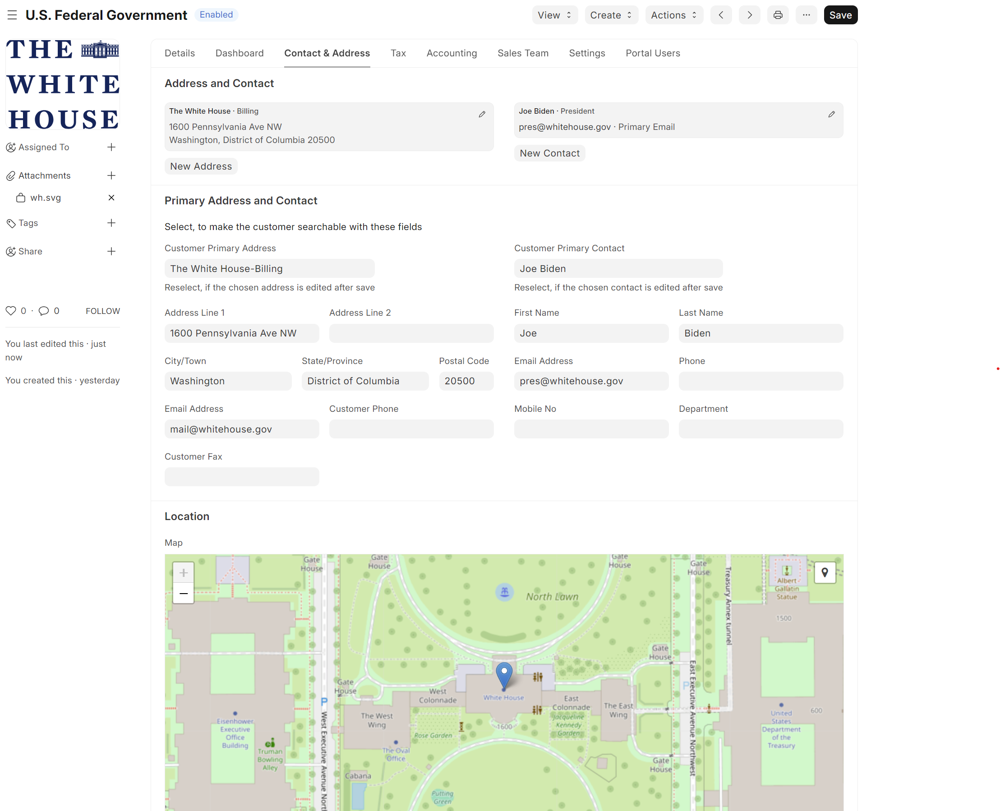
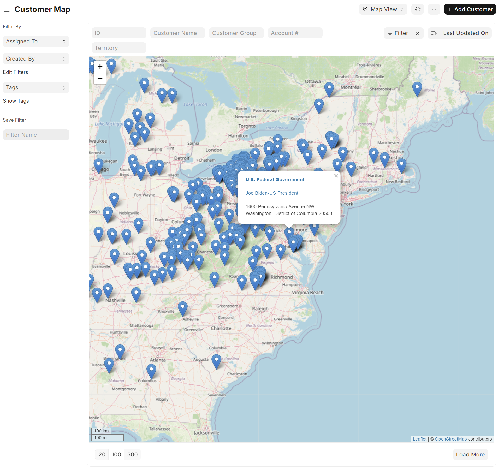

## ERPNext CIS Plus

ERPNext CIS Plus is a Frappe app that makes customer, contact and address handling in ERPNext easier for small businesses, where one contact and one address per customer is the normal case. It looks up and validates addresses through the free OpenStreetMap Nominatim service, lets you create and edit a customer's primary address and primary contact right on the Customer form, and adds a map view of your customers. The same primary address and contact editing is available on the Supplier form.

"CIS" is the name of the app. The original title of this README was "Customer Information System Enhancements for ERPNext", which is where the abbreviation comes from.

## What does it do?

- Adds geolocation and address validation to the Address Doctype (utilizes the free OpenStreetMap Nominatim service): on save, the address is looked up and its coordinates, postal code, state, county and city are filled in where they are blank. If the lookup fails, the save is stopped with an error.
- Sets the default address and contact automatically on the Customer Doctype
- Enables default address and contact editing on the Customer Doctype (and the Supplier Doctype): you can fill in the primary address and contact fields directly on the form, and the Address and Contact records are created or updated for you
- Normalizes phone numbers on the primary contact to E.164 format (using the `phonenumbers` package, with the country taken from the primary address) and warns when a number cannot be parsed
- Provides a map view with basic customer information for the Customer Doctype (uses Frappe's built-in geolocation and map view)

## What does it look like?

Here's a screenshot of the Customer Doctype with the new primary address and contact editing functionality:



Here's a screenshot of the Customer Doctype with the new map view functionality:



## How to install?

The app requires ERPNext. Install the app using the following commands

```bash
bench get-app https://github.com/Avunu/erpnext_cis_plus
bench --site [site-name] install-app erpnext_cis_plus
```

## Good to know

- Address validation sends the address text (street, city, state, postal code, country) to the public OpenStreetMap Nominatim service whenever an Address is saved. Nominatim's usage policy applies, so this app is a fit for small sites with modest address volumes.
- Customers appear on the map view once their primary address has coordinates.

## Show me the code!

Sure!
- The custom fields and properties Doctype overrides are located in [erpnext_cis_plus/erpnext_cis_plus/custom/](erpnext_cis_plus/erpnext_cis_plus/custom/).
- The Doctype hooks are located in [erpnext_cis_plus/erpnext_cis_plus/hooks/](erpnext_cis_plus/erpnext_cis_plus/hooks/).
- The Doctype js scripts are located in [erpnext_cis_plus/public/js/](erpnext_cis_plus/public/js/).
- Most of the above is forced into effect by the [erpnext_cis_plus/hooks.py](erpnext_cis_plus/hooks.py) file.

#### License

MIT. See [license.txt](license.txt).
